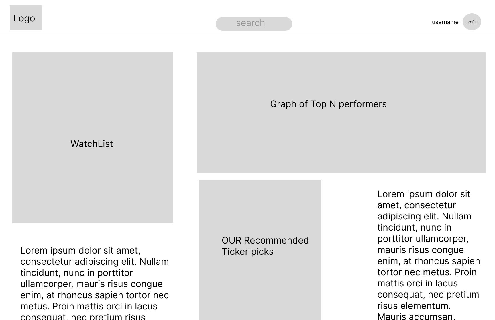
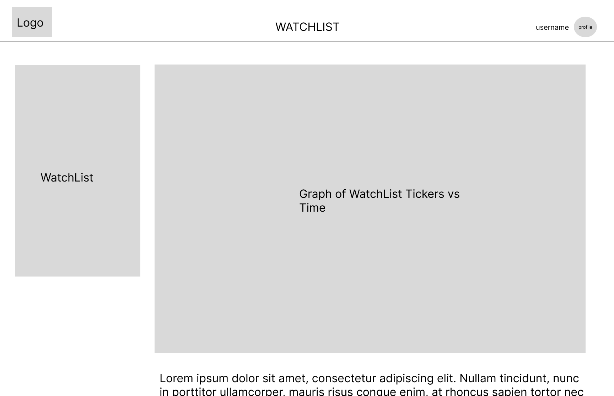

# User Experience Design

## Prototyping

The TickerPickr interactive prototype visually demonstrates the app’s key user flows and interface layout.
It shows how users move between different pages and features, serving as the foundation for the app’s front-end design and overall user experience.

[View the Figma Prototype](https://figma.com/proto/Js97KeZY56zWwtu2DALWoa/TickerPicker?node-id=44-2&p=f&t=LG1XfvelTjqrZsjy-0&scaling=scale-down&content-scaling=fixed&page-id=44%3A2&starting-point-node-id=44%3A80)

---

## App Map

## Wireframes

### 1. Home  
Displays the user’s watchlist, top performer graph, and recommended ticker picks.  

### 2. Log In  
Allows returning users to log in with their credentials.  

### 3. Notifications  
Displays alerts and updates related to watched or favorited stocks.  

### 4. Profile  
Shows the user’s details, saved tickers, and personalization options.  

### 5. Register  
Enables new users to create an account and join the platform.  

### 6. Screener  
Our filtering screen, showing a list of all stock and allows users to filter by the given metrics. 

### 7. Stock  
Displays detailed data and charts for the selected stock.  

### 8. Watchlist  
Lists all user-tracked stocks and quick performance summaries.  

